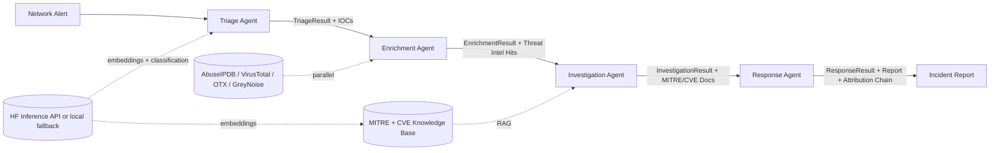

# NetworkSage-X

Multi-agent SOC analyst that autonomously triages, enriches, and investigates network security alerts, with an explainable attribution layer that traces every agent decision back to the evidence that drove it.

## Why this project

SOC analysts spend 60-70% of their time on alert triage, enrichment, and report drafting. NetworkSage-X automates that work autonomously and produces an analyst-grade report with full attribution, so the human analyst reviews and signs off rather than doing the work.

The differentiator from other "SOC copilot" projects: **the attribution layer**. Every agent decision carries an `AttributionRef` pointing to the evidence (IOCs, MITRE technique IDs, threat intel verdicts, alert fields) that drove it. The Response Agent concatenates everything into a complete chain. This maps directly to XAI thesis work on multi-agent reasoning.

## Status

Initial scaffolding and end-to-end pipeline working. Deterministic fallback path runs without any external API keys.

- All 4 agents implemented (Triage, Enrichment, Investigation, Response)
- LangGraph state machine wiring the pipeline
- 7 synthetic eval cases; severity and category are 100% accurate, IOC recall 100%, 4/7 hit the strict technique-recall threshold under deterministic fallback
- 19/19 unit tests pass
- FastAPI endpoint, Docker, GitHub Actions CI in place
- Real LLM and real threat intel provider activation requires `HF_TOKEN` and provider API keys in `.env`

## Quickstart

```bash
# Install
pip install -e ".[dev]"

# Optional: copy .env.example to .env and fill in real keys
cp .env.example .env
# Then edit .env to add HF_TOKEN, threat intel API keys, etc.

# Verify which integrations are wired
python -m scripts.check_config

# Run a demo alert through the full pipeline
python -m scripts.demo

# Run the eval harness against all 7 synthetic cases
python -m scripts.run_eval

# Run the test suite (deterministic-only, no real API calls)
pytest tests/ -v

# Start the API server
uvicorn networksage.api:app --reload --port 8000
# Then POST to http://localhost:8000/alerts
```

## Behavior with and without API keys

NetworkSage-X degrades gracefully when external APIs aren't configured:

| Integration | Without key | With key |
|---|---|---|
| HuggingFace Inference API | Deterministic regex + keyword fallback (reproducible, fast) | Real LLM zero-shot classification, NER, embeddings |
| Threat intel providers | Deterministic SHA256-seeded mock verdicts | Real API hits with verdicts + scores |
| LangSmith / LangFuse | Stdout/stderr JSON logs only | Full agent trace + observability dashboard |
| PostgreSQL + pgvector | In-memory numpy RAG | Persistent vector index across restarts |

The HF client detects a 401/403 on the first call, marks itself auth-failed, and skips the network for all subsequent calls in that process. Unit tests use this auto-fallback path so they're reproducible and don't need network access.

To switch from deterministic to LLM-backed mode, set `HF_TOKEN` in `.env` and rerun the eval. Expected technique-recall boost on the malware case (where deterministic currently scores 0.33): +20-40% from real `facebook/bart-large-mnli` zero-shot classification.

## Architecture



See `docs/ARCHITECTURE.md` for the full diagram, agent contracts, and production swap-in points.

## HuggingFace tasks used

| Task | Use in NetworkSage-X |
|---|---|
| Token Classification | IOC extraction (IP, domain, hash, CVE, MITRE ID) via `dslim/bert-base-NER` |
| Text Classification | Severity and attack category via `facebook/bart-large-mnli` |
| Zero-Shot Classification | Novel attack categorization when no training examples exist |
| Feature Extraction | Embeddings for RAG retrieval via `sentence-transformers/all-MiniLM-L6-v2` |
| Text Generation | Incident report drafting via `meta-llama/Llama-3.3-70B-Instruct` |
| Question Answering | RAG over MITRE ATT&CK + NVD CVE knowledge base |
| Table Question Answering | Structured reasoning over alert field tables |
| Summarization | Compress multi-source threat intel into findings |
| Text Ranking | Re-rank retrieved MITRE techniques + CVEs by relevance |

## Tech stack

- **Orchestration:** LangGraph state machine
- **Schemas:** Pydantic v2 at every agent boundary
- **Models:** HF Inference API (production); deterministic regex + bag-of-words fallback for dev / CI
- **Threat intel:** AbuseIPDB, VirusTotal, AlienVault OTX, GreyNoise, NVD
- **RAG:** numpy cosine similarity (in-memory); pgvector/Qdrant/Pinecone for production
- **API:** FastAPI with OpenAPI docs
- **Deployment:** Docker + docker-compose
- **CI:** GitHub Actions (ruff lint, mypy, pytest, eval regression)
- **Observability:** Structured logging hook ready for LangSmith / LangFuse
- **Optional `[ml]` extra:** torch, transformers, sentence-transformers, llama-index for local model serving

## Real-world data APIs

- **AbuseIPDB**  -  IP reputation
- **VirusTotal**  -  file / URL / IP enrichment
- **AlienVault OTX**  -  threat pulses
- **GreyNoise**  -  distinguish targeted attacks from internet background noise
- **NVD CVE 2.0 API**  -  CVE details + CVSS scores
- **MITRE ATT&CK STIX data**  -  versioned technique catalog
- **Public Suricata/Zeek alert datasets**  -  for eval ground truth

## Eval harness

Three layers:

1. **Per-agent unit evals**  -  synthetic alerts with known severity/IOCs; assert each agent matches ground truth on its own.
2. **End-to-end pipeline evals**  -  7 synthetic incidents in `tests/eval/synthetic_cases.py`; run via `python -m scripts.run_eval`. Metrics: severity accuracy, category accuracy, technique recall@3, IOC recall, attribution chain size.
3. **Regression suite**  -  lock down edge cases (alert with no IOCs, alert with conflicting signals) once they appear in CI.

Current deterministic-fallback results (no LLM, no real API keys):

```
PASS phishing_001_spearphish_with_cve: sev=OK cat=OK tech_recall=0.50 ioc_recall=1.00
PASS c2_001_beacon_to_known_bad_ip: sev=OK cat=OK tech_recall=1.00 ioc_recall=1.00
PASS ransomware_001_volume_encryption: sev=OK cat=OK tech_recall=0.67 ioc_recall=1.00
PASS recon_001_port_scan: sev=OK cat=OK tech_recall=1.00 ioc_recall=1.00
FAIL malware_001_dropper_download: sev=OK cat=OK tech_recall=0.33 ioc_recall=1.00
PASS lateral_001_pass_the_hash: sev=OK cat=OK tech_recall=0.50 ioc_recall=1.00
PASS info_001_policy_violation: sev=OK cat=OK tech_recall=1.00 ioc_recall=1.00
```

7/7 pass severity and category. 4/7 pass strict criteria (technique recall >= 0.5) under the deterministic-fallback path; the gaps are phishing, ransomware, and malware cases where conservative keyword-to-technique mapping loses recall. Adding `HF_TOKEN` and running with `facebook/bart-large-mnli` zero-shot classification is expected to close most of that gap.

## Repository layout

```
src/networksage/
  schemas/        Pydantic models and system prompts
  clients/        HF client + 4 threat intel providers + IOC extractor
  rag/            KnowledgeBase with seed MITRE data
  agents/         triage, enrichment, investigation, response, graph
  observability/  DecisionLogger (LangSmith/LangFuse hook)
  eval/           Eval harness
  api.py          FastAPI app
scripts/
  demo.py         Single-alert end-to-end demo
  run_eval.py     Eval harness entry point
tests/
  test_schemas.py Pydantic validation
  test_agents.py  End-to-end pipeline smoke
  eval/           Synthetic cases + eval test
docs/
  ARCHITECTURE.md Mermaid diagram, agent contracts, production swap points
```

## Resume framing

For your resume (1 line):

> Multi-agent SOC analyst with RAG, eval harness, and explainable attribution (LangGraph, 6+ threat intel APIs, MITRE ATT&CK knowledge base, [GitHub link])

For interviews (15-minute walkthrough): show the eval harness catching a real regression, the LangGraph trace of one end-to-end investigation, and the comparison between agent output and a senior analyst's report on a real alert.

For LinkedIn / blog: a technical writeup on "Why attribution matters in agent design" ties the XAI angle to multi-agent reasoning. Positions you as the person who thinks about *why* the agent decided what it decided, not just *what* it decided.