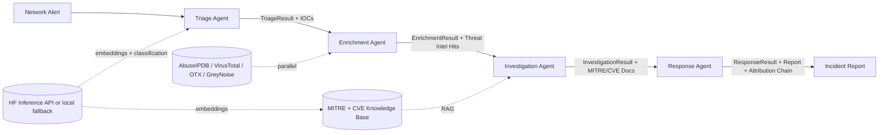

# NetworkSage-X Architecture

## High-level data flow

## Agent contracts

Every agent takes a `PipelineState` (or its inputs) and produces a typed
result that is written back to state. Schema violations fail loudly so the
pipeline cannot drift.

| Agent | Reads | Writes |
|---|---|---|
| Triage | `alert` | `triage: TriageResult` |
| Enrichment | `triage.indicators` | `enrichment: EnrichmentResult` |
| Investigation | `triage`, `enrichment`, KB | `investigation: InvestigationResult` |
| Response | `triage`, `enrichment`, `investigation` | `response: ResponseResult` |

## Attribution layer

Every agent attaches `AttributionRef` instances to its result. The Response
Agent concatenates all upstream attribution into `full_attribution_chain`,
which becomes the "why did the agent decide what it decided" trail in the
report.

This is the XAI-into-multi-agent bridge: the same rigor applied to model
attribution in the master's thesis now applies to agent decisions.

## Eval harness

Three layers:

1. **Per-agent unit evals:** synthetic alerts with ground truth, assert
   each agent matches ground truth on its own.
2. **End-to-end pipeline evals:** 7 synthetic cases in `tests/eval/synthetic_cases.py`,
   run via `python -m scripts.run_eval`.
3. **Regression suite:** lock down edge cases (alert with no IOCs, alert
   with conflicting signals) once they appear in CI.

## Production swap-in points

- **LLM:** swap `HFClient.chat(...)` to vLLM / TGI / OpenAI / Anthropic by
  extending the client.
- **Vector store:** swap `KnowledgeBase` to pgvector / Qdrant / Pinecone.
- **Observability:** wire `DecisionLogger` to LangSmith or LangFuse by
  extending `log_agent_decision`.
- **Auth / rate limit:** add FastAPI middleware in `api.py`.